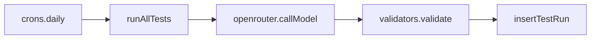

# Development

## Overview

- **Stack**: Next.js 16 (App Router), React 19, Convex (backend and real-time), OpenRouter for LLM calls, Tailwind and shadcn/ui, Vitest.
- **Purpose**: The frontend reads test cases, models, leaderboard, and comparison grid from Convex. Automated tests run via a Convex cron (daily 03:00 UTC) that calls OpenRouter and writes results to Convex.

## Project structure

- **`app/`** — Next.js App Router: [layout.tsx](app/layout.tsx), [page.tsx](app/page.tsx) (preloads Convex queries), [convex-provider.tsx](app/convex-provider.tsx).
- **`components/`** — `landing/` (hero, leaderboard, comparison grid, tests, methodology, footer), `custom/` (status icon, trend, memeness stars, data freshness), `ui/` (shadcn).
- **`convex/`** — [schema.ts](convex/schema.ts) (testCases, aiModels, testRuns), [queries.ts](convex/queries.ts), [mutations.ts](convex/mutations.ts) (internal insertTestRun), [seed.ts](convex/seed.ts), [crons.ts](convex/crons.ts), [actions/](convex/actions/) (runTests, openrouter, validators), [seeds/](convex/seeds/) (testCases, aiModels).
- **`lib/`** — [types.ts](lib/types.ts), [utils.ts](lib/utils.ts).

## Data and execution flow

### Frontend data flow

- [app/page.tsx](app/page.tsx) preloads five Convex queries (`getActiveTestCases`, `getActiveModels`, `getLeaderboard`, `getComparisonGrid`, `getLastTestRunTime`) and passes the preloaded refs to [LandingPage](components/landing/landing-page.tsx).
- The landing page uses `usePreloadedQuery` for each; [ConvexProvider](app/convex-provider.tsx) supplies the Convex client (using `NEXT_PUBLIC_CONVEX_URL`).
- Data comes from Convex tables: testCases, aiModels, and testRuns (aggregated in queries).

### Test execution flow

- The cron ([convex/crons.ts](convex/crons.ts)) runs daily at 03:00 UTC and invokes `api.actions.runTests.runAllTests`.
- [runTests.ts](convex/actions/runTests.ts) loads active tests and models via queries, calls [openrouter.ts](convex/actions/openrouter.ts) for each (model × test), validates with [validators.ts](convex/actions/validators.ts), then calls the internal mutation [insertTestRun](convex/mutations.ts) to store each result in testRuns.

## Local development

- **Prerequisites**: Node 20+, pnpm.
- **Commands**:
  - `pnpm install`
  - `pnpm dev` — Next.js dev server.
  - In a second terminal: `npx convex dev` — Convex sync and codegen; use the Convex dashboard URL for the dev deployment.
  - Seed once: `npx convex run seed:seedDatabase` (and optionally `seed:seedTestRuns` for mock runs).
  - Lint / type-check / build / test: `pnpm run lint`, `pnpm run type-check`, `pnpm run build`, `pnpm run test`.
- **Environment**:
  - Frontend: `NEXT_PUBLIC_CONVEX_URL` (Convex deployment URL from the dashboard or `npx convex dev`).
  - Convex backend (for running tests locally or in CI): set `OPENROUTER_API_KEY` in the Convex dashboard (Settings → Environment Variables) for the deployment.
- Do not commit `.env.local`; only the variable names above are required (no secrets in this doc).

## Testing

- **Runner**: Vitest; `pnpm test` runs `vitest run`.
- **Config**: [vitest.config.ts](vitest.config.ts) — Node environment, `**/*.test.ts`, excludes node_modules and .next.
- **Location**: Unit tests sit next to the code they cover, e.g. [convex/actions/validators.test.ts](convex/actions/validators.test.ts) for [validators.ts](convex/actions/validators.ts).

## CI and deployment

GitHub Actions runs lint, type-check, build, and tests on every push and PR. To deploy the Convex backend on push to `main`, add a **Convex production deploy key** as a repository secret: **Settings → Secrets and variables → Actions → New repository secret** named `CONVEX_DEPLOY_KEY`. Create the key in the [Convex dashboard](https://dashboard.convex.dev) under your deployment (Deployment Settings → Deploy key).
